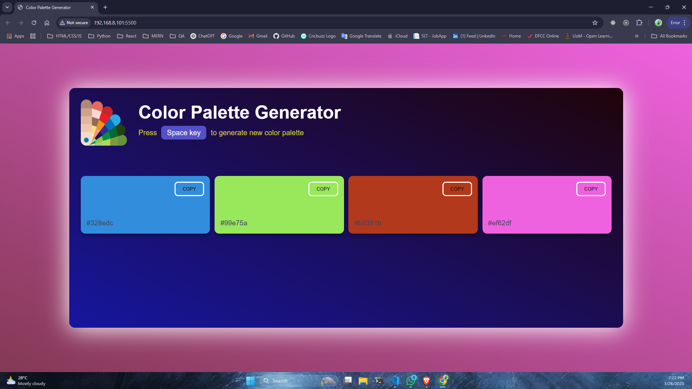

# Color Palette Generator




A simple and interactive **Color Palette Generator** that allows users to generate random color palettes and copy color codes to the clipboard. Users can press the **Space key** to generate new color combinations dynamically.

## Features
- Generates random color palettes on pressing the **Space key**.
- Displays color codes for each generated color.
- Allows users to **copy** color codes to the clipboard with a button click.
- Provides an **input color picker** to manually adjust colors.
- Responsive and visually appealing UI.

## Technologies Used
- **HTML** - Structure of the application.
- **CSS** - Styling and layout.
- **JavaScript** - Dynamic color generation, clipboard functionality, and event handling.

## How to Use
1. Open the `index.html` file in a browser.
2. Press the **Space key** to generate a new random color palette.
3. Click the **Copy** button to copy a color code to the clipboard.
4. Use the **color picker** to manually adjust a color.

## Installation
1. Clone the repository:
   ```sh
   git clone https://github.com/your-username/color-palette-generator.git
   ```
2. Navigate to the project folder:
   ```sh
   cd color-palette-generator
   ```
3. Open `index.html` in your browser.

## Files Overview
- `index.html` - Main HTML structure of the project.
- `style.css` - Styles for layout and design.
- `script.js` - JavaScript logic for color generation and clipboard functionality.
- `image.png` - Logo image used in the project.

## Troubleshooting
If the **Copy to Clipboard** functionality is not working:
- Ensure your browser supports the **Clipboard API** (use Chrome, Firefox, or Edge).
- The project should be running on **HTTPS** or **localhost**, as clipboard access is restricted on HTTP.
- Try an alternative method using `document.execCommand("copy")` if needed.

## Future Enhancements
- Add a feature to save favorite color palettes.
- Implement a download feature for color palettes.
- Provide different color scheme options (monochrome, complementary, etc.).

## License
This project is open-source and available under the **MIT License**.

---
Developed by [Your Name]

